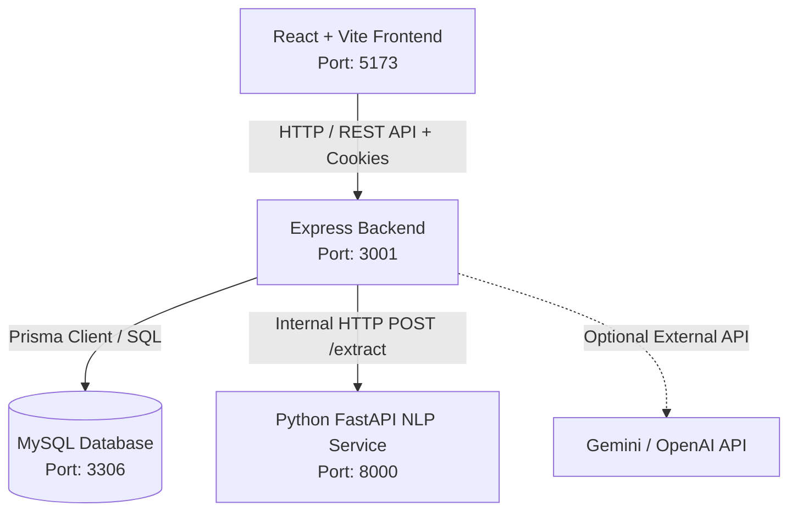

# KnowVerse — Architecture & System Design

## 1. System Overview

KnowVerse is architected as a modular, three-tier full-stack system designed for scalability, maintainability, and clean separation of concerns:

---

## 2. Core Subsystems

### 2.1. Frontend Layer (`knowverse/frontend`)
- **Framework**: React 18 with TypeScript and Vite bundler.
- **Styling**: Tailwind CSS with dark-mode first design tokens, CSS variables, and glassmorphism styling.
- **State Management**:
  - Global Session / Auth: Zustand with `localStorage` persistence.
  - Server Cache & Synchronizations: `@tanstack/react-query` v5 with optimistic updates and automatic cache invalidation.
- **Graph Visualization**: React Flow v11 with custom nodes, dynamic edge rendering, interactive canvas, minimap, and zoom controls.
- **Routing & Guards**: React Router v6 with `ProtectedRoute` wrappers for standard and administrator tiers.

### 2.2. Backend REST API Layer (`knowverse/backend`)
- **Runtime**: Node.js with TypeScript and Express.
- **Validation**: Strict schema validation on incoming payloads using Zod schemas before hitting controllers.
- **ORM & Data Layer**: Prisma ORM v5 with MySQL 8 engine.
- **Security & Middleware**:
  - `helmet`: Security HTTP response headers.
  - `cors`: Configured for origin control and credentials handling.
  - `cookie-parser`: Secure HTTP-only JWT token delivery.
  - `express-rate-limit`: Brute-force protection on auth endpoints and global protection.
  - `winston` & `morgan`: Structured application logging with log level filtering.
  - `auditLog`: Automated post-response audit logging middleware capturing actor, action, entity, and IP.

### 2.3. AI / NLP Microservice (`knowverse/ai-service`)
- **Framework**: Python 3.10+ with FastAPI and Uvicorn.
- **NLP Engine**: spaCy (`en_core_web_sm`) performing tokenization, Named Entity Recognition (NER), sentence boundary detection, and syntactic dependency parsing.
- **Extraction Logic**: Hybrid approach combining dependency tree traversal (subject-verb-object), cross-entity verb pattern extraction, and regex predicate templates.
- **Resilience**: Independent microservice that can be scaled independently of the API gateway, with fallback pattern extraction if spaCy is offline.

---

## 3. Security Architecture

1. **Authentication**: JWT signed with secret, set in HTTP-only, SameSite cookies or `Authorization: Bearer` headers.
2. **Password Security**: Bcrypt with salt rounds = 12. Plaintext passwords are never logged, stored, or returned.
3. **Role-Based Access Control (RBAC)**: Distinct permissions for `USER` and `ADMIN`. Dangerous graph operations (merge, delete, rename) and user management require `ADMIN` role.
4. **Input Sanitization**: File uploads are restricted by MIME type and extension; filenames are hashed to random UUIDs on disk to prevent directory traversal.
5. **Database Safety**: All queries use parameterized statements via Prisma. Multi-table mutations are wrapped in atomic database transactions (`prisma.$transaction`).
