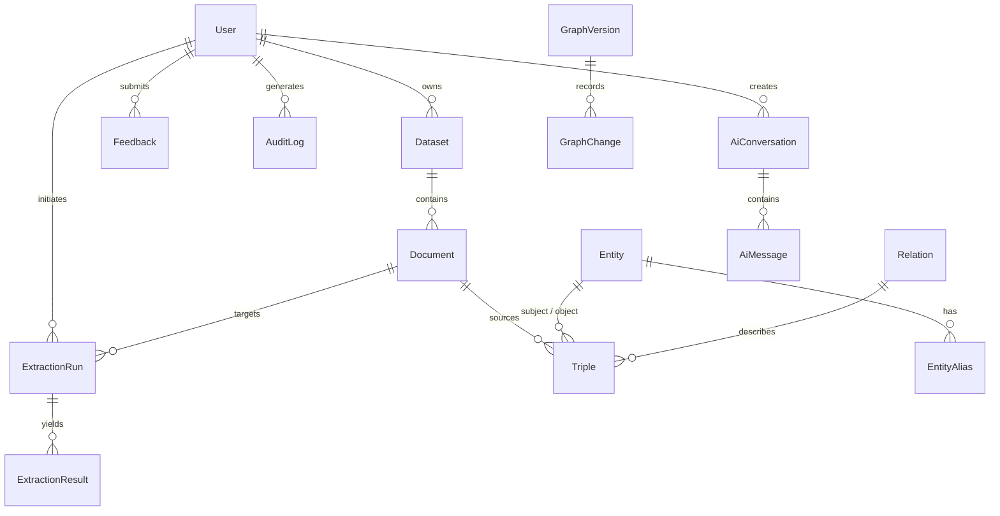

# KnowVerse — Database Schema & Data Models

KnowVerse uses a normalized MySQL 8 database managed via **Prisma ORM**. All tables use UUID primary keys, foreign key constraints with cascading deletes where appropriate, and explicit indexes for high query performance.

---

## 1. Entity-Relationship Overview

---

## 2. Table Specifications

### `users`
Core user identity and authentication record.
- `id` (VARCHAR 36, PK): UUID
- `name` (VARCHAR 255): Display name
- `email` (VARCHAR 255, Unique): Login email
- `passwordHash` (VARCHAR 255): Bcrypt hash (cost 12)
- `role` (ENUM: `USER`, `ADMIN`): Access tier
- `isActive` (BOOLEAN): Soft ban / active status
- `createdAt`, `updatedAt` (DATETIME)

### `datasets`
Logical containers for uploaded or ingested text collections.
- `id` (VARCHAR 36, PK): UUID
- `name` (VARCHAR 255): User-defined title
- `description` (TEXT): Optional notes
- `status` (ENUM: `UPLOADED`, `PROCESSING`, `EXTRACTING`, `COMPLETED`, `FAILED`)
- `ownerId` (FK -> `users.id`)

### `documents`
Extracted textual items or parsed files belonging to a dataset.
- `id` (VARCHAR 36, PK): UUID
- `datasetId` (FK -> `datasets.id`)
- `title` (VARCHAR 255): Document title
- `content` (LONGTEXT): Raw document text
- `source` (VARCHAR 255): File origin or manual entry

### `entities`
Nodes in the knowledge graph.
- `id` (VARCHAR 36, PK): UUID
- `name` (VARCHAR 255): Display name (e.g., "Infosys")
- `normalizedName` (VARCHAR 255, Unique): Lowercase trimmed identifier for fast deduplication (e.g., "infosys")
- `entityType` (VARCHAR 50): Classification (e.g., `ORG`, `PERSON`, `PRODUCT`, `CONCEPT`)
- `description` (TEXT): Entity summary

### `relations`
Predicates connecting two entity nodes.
- `id` (VARCHAR 36, PK): UUID
- `name` (VARCHAR 255): Display predicate (e.g., "founded by")
- `normalizedName` (VARCHAR 255, Unique): Lowercase trimmed predicate (e.g., "founded by")

### `triples`
Edges in the knowledge graph: `(Subject Entity) -> [Relation] -> (Object Entity)`.
- `id` (VARCHAR 36, PK): UUID
- `subjectEntityId` (FK -> `entities.id`)
- `relationId` (FK -> `relations.id`)
- `objectEntityId` (FK -> `entities.id`)
- `confidence` (FLOAT): 0.0 - 1.0 extraction confidence score
- `status` (ENUM: `PENDING`, `APPROVED`, `REJECTED`)
- `sourceDocumentId` (FK -> `documents.id`, Optional)
- `sourceText` (TEXT): Surrounding sentence context
- **Unique Constraint**: `(subjectEntityId, relationId, objectEntityId)`

### `extraction_runs` & `extraction_results`
Staging tables for NLP extractions before human approval.
- `extraction_runs`: Status of NLP task (`QUEUED`, `RUNNING`, `COMPLETED`, `FAILED`)
- `extraction_results`: Candidate triples with raw text, confidence score, and staging status (`PENDING`, `APPROVED`, `REJECTED`)

### `graph_versions` & `graph_changes`
Audit trail and change-tracking for graph modifications (merges, renames, deletions).
- Captures `previousValue` and `newValue` as JSON for rollback capabilities.

### `audit_logs`
Security compliance logging tracking all mutations, logins, and administrative actions.

### `ai_conversations` & `ai_messages`
Persisted chat history with AI Assistant, storing graph grounding metadata and sources.
